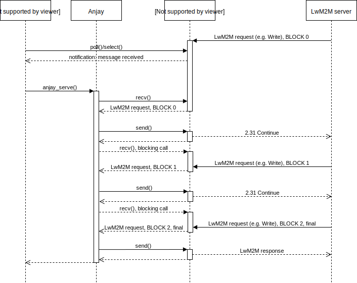
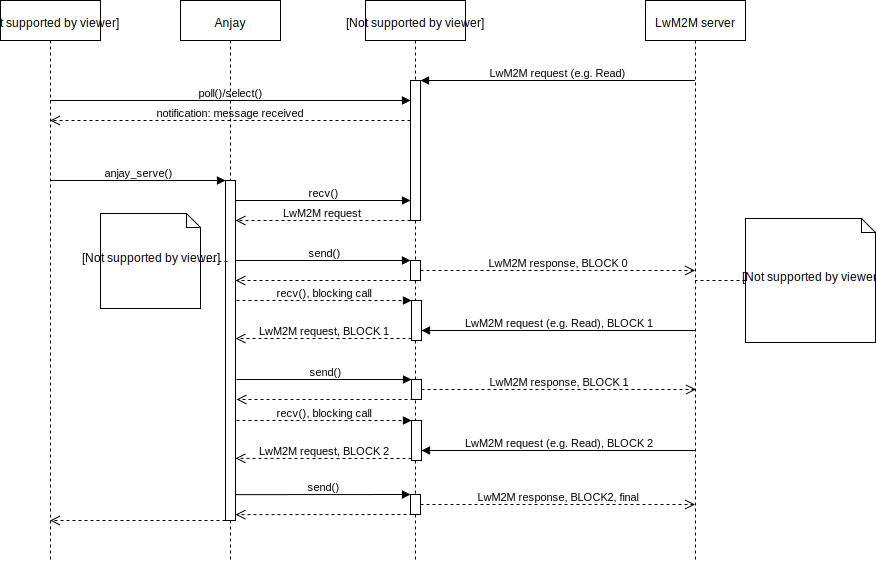
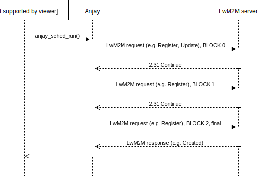

..
   Copyright 2017-2020 AVSystem <avsystem@avsystem.com>

   Licensed under the Apache License, Version 2.0 (the "License");
   you may not use this file except in compliance with the License.
   You may obtain a copy of the License at

       http://www.apache.org/licenses/LICENSE-2.0

   Unless required by applicable law or agreed to in writing, software
   distributed under the License is distributed on an "AS IS" BASIS,
   WITHOUT WARRANTIES OR CONDITIONS OF ANY KIND, either express or implied.
   See the License for the specific language governing permissions and
   limitations under the License.

A few notes on general usage
============================

.. _single-request-single-function-call:

Single request - single function call
-------------------------------------

To start, we first need to establish that Anjay LwM2M Client API assumes a
single-threaded mode of operation. It relies on the user calling
``anjay_serve()`` whenever some packet is received and ``anjay_sched_run()``
regularly, as described in the :doc:`another chapter <BC3>`. Both of the
methods block until the incoming message or (respectively) a job is processed.

An incoming message may either be fully contained in a single packet, or split
between multiple packets, however ``anjay_serve()`` is called just for the
first one. Other parts (if any) are fetched internally by the library. In other
words: ``anjay_serve()`` blocks until the message gets handled completely.

.. figure:: _images/anjay-server-request.svg
   :width: 100%

   Handling a single LwM2M request. The application gets notified a packet
   was received on a socket using ``poll()``/``select()`` and calls
   ``anjay_serve()`` on that socket, allowing the library to interpret the
   request and create a response.

When considering a request from the LwM2M Server, the block-wise transfer may
be initiated either by server (e.g. a big Write request) or by the client
(e.g. a large response to a Read request).

   Handling a block-wise request from the LwM2M Server. The server realizes
   its request is too big to fit in a single packet and explicitly initiates
   block-wise transfer by adding CoAP BLOCK option to the request. A single
   call to ``anjay_serve()`` blocks the client until the request is completely
   handled.

   A block-wise response to a non-block request from the LwM2M Server. In
   this case, the server performs a simple Read request. The client realizes
   that returned data is too big, and adds a BLOCK option to the response.
   The server then requests further blocks of a response. The call to
   ``anjay_serve()`` only returns after the last block of a response is sent.

Similar situation arises when the client attempts to send a Register or Update
LwM2M request to the server with a large list of available Object Instances,
or a big Notify message. The difference is that the client sends its own
requests from within ``anjay_sched_run()`` call instead of ``anjay_serve()``.

.. figure:: _images/anjay-client-request.svg
   :width: 100%

   A simple request from the LwM2M Client.

   A block-wise request from the LwM2M Client. ``anjay_sched_run()`` call
   blocks until the full transfer is complete.

Because ``anjay_serve()`` blocks after a packet arrives, the library can
handle at most one LwM2M Server at time, which makes its usage convenient,
as one does not have to worry about data model being accessed or modified
by multiple LwM2M Servers at the same time. Unfortunately it may happen to
be a problem, as during blockwise transfers the library is unable to respond
to other LwM2M Servers with anything else than 5.03 Service Unavailable.

Before getting worried about it too much, one shall realize that the above
behavior happens only when a blockwise transfer is issued on some part of
the data model - i.e. for that to become a problem one would have to store
and transfer big amounts of data regularly through LwM2M which, in context of
resource constrained environments targeted by the LwM2M protocol might not
be the best fit.

.. note::

   The blocking behavior does not apply to firmware downloaded using the PULL
   method. See :ref:`firmware-transfer` for details.

Transactions and ``anjay_serve()``
----------------------------------

Our data model supports transactional operations. They are here to ensure that
whenever something goes wrong during a transaction, all changes applied since
its beginning can be reverted - keeping the LwM2M Client in a consistent state.

As we already know, calling ``anjay_serve()`` corresponds to processing a
single LwM2M request. This, along with properly implemented transaction
handlers guarantees that if the LwM2M Client was in a consistent state
before request had been received, then it will remain in a consistent state
after the request is processed. Moreover, because of single-threaded mode of
operation no other LwM2M Server can see the LwM2M Client being in partially
consistent state.

Things work a bit different during the Bootstrap Sequence though. When the
Client/Server initiated Bootstrap begins, the library fires transaction
handlers for all data model entities. At the same time, it enters the state
where requests originated from Bootstrap Server only are handled - there may be
more than one such request, and so ``anjay_serve()`` could get called multiple
times. This again does not hurt consistency in any way, because according to
the LwM2M Specification, the LwM2M Client may ignore other servers during that
special time, and the library is doing just that - meaning
that they won't be able to observe intermediate initialization state.

After the Bootstrap Sequence finishes the library checks that the data model is
valid, and if it isn't the previous correct state will be restored, which
proves the point.

Notifications
-------------

Anjay uses its scheduler to track pending notifications. Whenever
a notification has to be sent, it is done from within ``anjay_sched_run()``
function.

.. note::

   Calling ``anjay_notify_changed()`` or ``anjay_notify_instances_changed()``
   does not send notifications immediately - they use the scheduler instead.

.. figure:: _images/anjay-notification.svg
   :width: 100%

   Sending a LwM2M Notify message.
