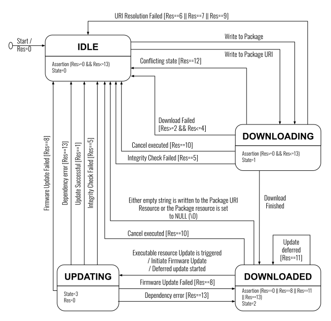

..
   Copyright 2017-2024 AVSystem <avsystem@avsystem.com>
   AVSystem Anjay LwM2M SDK
   All rights reserved.

   Licensed under the AVSystem-5-clause License.
   See the attached LICENSE file for details.

Firmware Update State Diagram
=============================

The figure above shows an implementation of the **Advanced Firmware Update**
mechanism. The state diagram consists of states, drawn as rounded rectangles,
and transitions, drawn as arrows connecting the states. The syntax of the
transition is trigger [guard] / behavior. A trigger is an event that may cause
a transition, a guard is a condition and behavior is an activity that executes
while the transition takes place. The states additionally contain a compartment
that includes assertions and variable assignments. For example, the assertion
in the IDLE state indicates the value of the “Update Result” resource
(abbreviated as “Res”) must be between 0 and 13. The State resource is set to
zero (0) when the program is in this IDLE state.

Any operation to the Firmware Update Object that would result in undefined
behavior because that specific operation is not identified as a trigger in the
state machine (e.g. Write to Package URI while in DOWNLOADING state) SHOULD be
rejected.

Errors during the Firmware Update process MUST be reported only by the “Update
Result” resource. For instance, when the LwM2M Server performs a Write
operation on resource “Package URI”, the LwM2M Client returns a Success or
Failure for the Write operation. Then if the URI is invalid, it changes its
“Update Result” resource value to 7.
