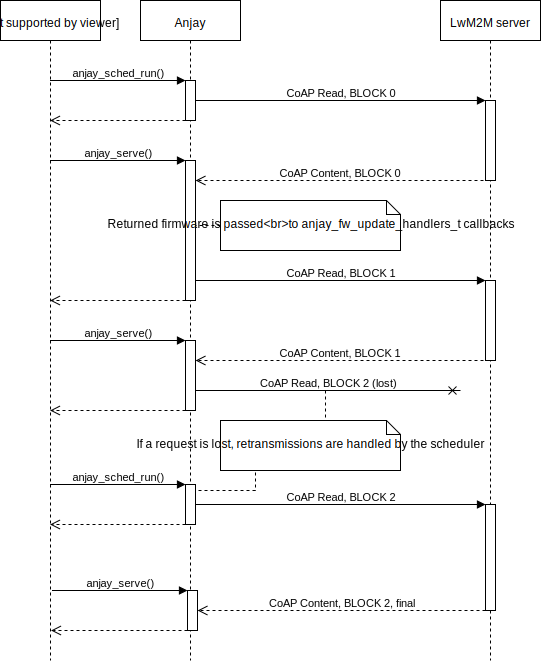

..
   Copyright 2017-2020 AVSystem <avsystem@avsystem.com>

   Licensed under the Apache License, Version 2.0 (the "License");
   you may not use this file except in compliance with the License.
   You may obtain a copy of the License at

       http://www.apache.org/licenses/LICENSE-2.0

   Unless required by applicable law or agreed to in writing, software
   distributed under the License is distributed on an "AS IS" BASIS,
   WITHOUT WARRANTIES OR CONDITIONS OF ANY KIND, either express or implied.
   See the License for the specific language governing permissions and
   limitations under the License.

Download modes and protocols
============================

.. _firmware-transfer:

Firmware transfer
^^^^^^^^^^^^^^^^^

The LwM2M protocol defines two modes of firmware download:

- **PUSH** - the download is initiated by the Server, performing a Write
  operation on the /5/0/0 (Package) Resource. This usually means a block-wise
  transfer, which for Anjay based clients will prevent handling other
  LwM2M requests until the Write completes, as described in
  :ref:`single-request-single-function-call`.

- **PULL** - the LwM2M Server indicates where should the client download
  firmware package from with Write on /5/0/1 (Package URI) Resource. The client
  then performs the download asynchronously, while still being able to handle
  LwM2M requests.

   Anjay generally handles asynchronous CoAP downloads within
   ``anjay_serve()`` calls. The ``anjay_sched_run()`` may initiate the
   download or retransmit requests in case of packet loss. Downloaded firmware
   is passed to the application through callbacks configured using
   ``fw_update`` field of the ``anjay_configuration_t`` struct passed to
   ``anjay_new()``. For more details, see API reference.

The download protocols officially defined in the LwM2M Specification are:

- CoAP(s)/UDP,
- CoAP(s)/TCP,
- HTTP(s).

Anjay supports all of them out of the box in a default
configuration. Configuring the specific set of features relevant for the
user is a matter of setting a few CMake options:

- ``WITH_DOWNLOADER`` - enables/disables **PULL** downloads in general (`ON`
  by default),
- ``WITH_COAP_DOWNLOAD`` - enables/disables **PULL** downloads over CoAP(s)
  (`ON` by default),
- ``WITH_HTTP_DOWNLOAD`` - enables/disables **PULL** downloads over HTTP(s)
  (`ON` by default),
- ``WITH_AVS_COAP_UDP`` - enables/disables CoAP/UDP (`ON` by default),
- ``WITH_AVS_COAP_TCP`` - enables/disables CoAP/TCP (`ON` by default, in
  **commercial version** only).

Which download mode should you choose
^^^^^^^^^^^^^^^^^^^^^^^^^^^^^^^^^^^^^

Although in the end, it is the Server that selects download method,
we advise persuading your Server provider to use **PULL** transfers
exclusively.

The unfortunate limitation of a **PUSH** download mode in Anjay is that
it completely blocks the client. In other words, while conducting **PUSH**
download, Anjay is pretty much unable to do anything else. Because of that
it is **strongly recommended** to use **PULL** mode, which is implemented
asynchronously in the library.

.. important::

    We recommend using **PULL** download mode due to limitations imposed on
    other download modes.

Which download protocol should you choose
^^^^^^^^^^^^^^^^^^^^^^^^^^^^^^^^^^^^^^^^^

Again, it's the Server decision which protocol shall be utilized for the
download (of course out of the list of supported protocols, which you MAY
control, at least partially, through the list of CMake options mentioned
in former sections), but downloads using CoAP(s)/UDP tend to be slow due
to limitation of the maximum CoAP BLOCK size of 1024 bytes. The fact that
each Block-Wise packet needs an acknowledgement from the other side does
not help either.

If the download speed is important you should stand with either CoAP(s)/TCP or
HTTP(s) as the download protocol.
